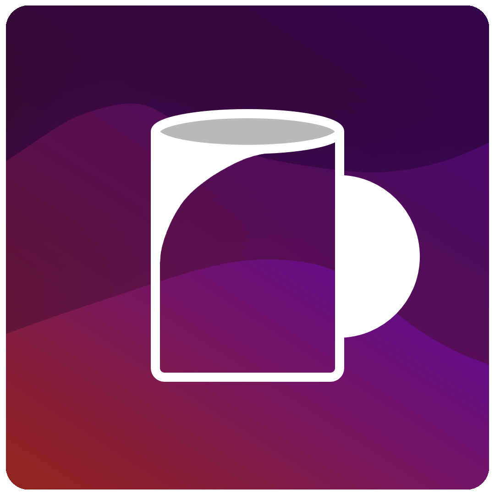
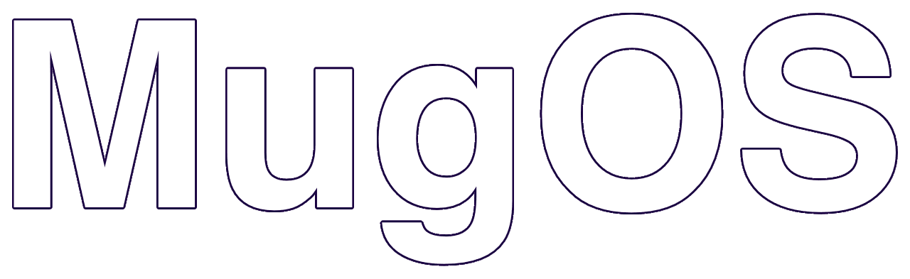

    <a href="https://mugos.twitchapis.org" ></img> </a>
    <a href="https://mugos.twitchapis.org" ></img></a>

 
 

    <h2>MugOS is open-source operational system made from scratch.</h2>
    Help contribute with this readme! we will be glad to see your ideas for this readme!
     
     
    <a href='https://mugos.twitchapis.org/'>Access Website</a>

 
 
<h1></h1>
<h2>Wiki:</h2>
<a href='https://mugos.twitchapis.org/wiki'>You can find the full documentation and wiki on this url</a>
 
 
<h2>Discord:</h2>
<a href='https://mugos.twitchapis.org/wiki'>You can access the discord community on this url</a>
 
 
 
 

<i>Made with 💜 and ☕ by MugOS Team and the comunity</i>
